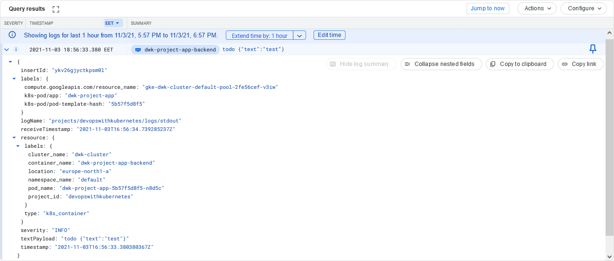

# Exercise 3.06: DBaaS vs DIY

## DBaaS

### Pros

-   Easier initial setup
-   Not have to worry about security updates or maintenance
-   Less work on scaling issues
-   Easier automatic backups and recovery
-   Possibility for high availability (multi-region/zone)

### Cons

-   Vendor lock-in
-   Pricing structure might be more complicated
-   Not everything is configurable

## DIY

### Pros

-   More configurable in every way (resources, scaling etc)
-   Pricing perhaps easier to predict

### Cons

-   Harder initial setup
-   No automatic maintenance

---

# Exercise 3.07: Commitment

I picked Google Cloud SQL for the project since I haven't used it before.

---

# Exercise Exercise 3.10: Project v1.6

